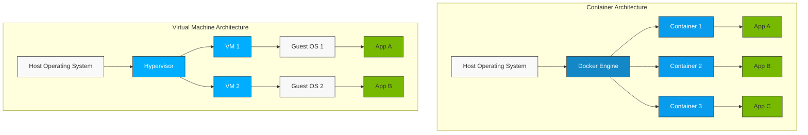
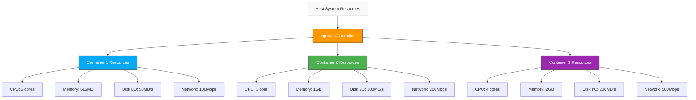
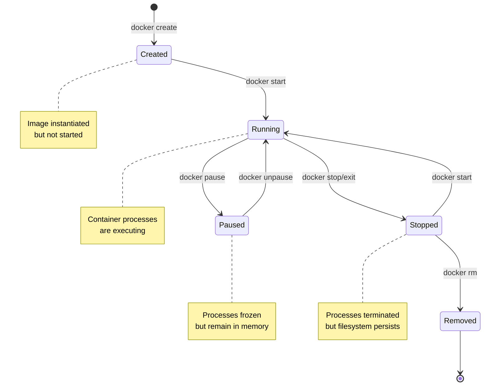

# Inception - Docker Infrastructure Project

A comprehensive Docker-based web infrastructure implementing WordPress, NGINX, MariaDB, and additional services with a focus on security, modularity, and best practices.

## Project Architecture

```ascii
                                +-----------------------+
                                |        Docker         |
                                |     Infrastructure    |
                                +-----------------------+
                                            |
               Mandatory +----+-------------+-------------+
                              |             |             |
                       +------v------+ +----v-------+ +---v------+
                       |   NGINX     | | WordPress  | | MariaDB  |
                       | Container   | | Container  | |Container |
                       +------+------+ +---+--------+ +---+------+
                              |            |              |
                              |            |              |
          Bonus +----+--------+--+---------+----------+---+-------+
                     |           |         |          |           |
               +-----v---+ +-----v---+ +---v-----+ +--v------+ +--v--------+
               |  Redis  | |   FTP   | | Adminer | | Static  | | Portainer |
               |  Cache  | |  Server | |         | | Website | |           |
               +---------+ +---------+ +---------+ +---------+ +-----------+

                     Volumes +------+----------------+
                                    |                |
                              +-----v-----+    +-----v----+
                              | WordPress |    | Database |
                              |   Files   |    |   Data   |
                              +-----------+    +----------+
```

## Security Measures

1. Environment Variables
   - Stored in .env file
   - No hardcoded credentials
   - Secure variable passing

2. Network Isolation
   - Custom Docker network
   - Internal service communication
   - Limited external access

3. TLS Implementation
   - TLSv1.2/1.3 only
   - Strong cipher suites
   - Proper certificate management

## Setup Instructions

1. Clone the repository:

   ```bash
   git clone https://github.com/ElmehdiBennix/Inception_42.git
   cd Inception_42
   ```

2. Create .env file:

   ```bash
   # Edit srcs/.env with your configurations
   cp srcs/.env.example srcs/.env
   ```

3. Build and start services:

   ```bash
   # Start the project
   make
   # down the project
   make down
   # remove the project from docker
   make fclean
   ```

## Understanding Docker and Container Architecture

### What is Docker?

Docker is a platform for developing, shipping, and running applications in isolated environments called containers. Unlike traditional virtual machines that emulate entire operating systems, Docker containers share the host system's kernel and isolate only the application layer. This makes them lightweight, fast to start, and efficient with system resources.

## Containers vs. Virtual Machines

To understand Docker, we first need to compare containers with traditional virtualization:



The key difference is that traditional VMs virtualize the entire hardware stack and run a complete OS for each VM, while containers share the host OS kernel and isolate only the application layer. This makes containers significantly more lightweight and efficient.

## Linux Technologies That Enable containerization

Docker leverages several Linux kernel features to achieve containerization:

### 1. Namespaces

Namespaces provide isolation for system resources, making processes in a container believe they have their own instance of global resources. Linux implements six types of namespaces that Docker uses:

1. **PID Namespace**: Isolates process IDs. Processes in different namespaces can have the same PID.
2. **Network Namespace**: Isolates network interfaces, routing tables, firewall rules, etc.
3. **Mount Namespace**: Isolates filesystem mount points.
4. **UTS Namespace**: Isolates hostname and domain name.
5. **IPC Namespace**: Isolates interprocess communication resources.
6. **User Namespace**: Isolates user and group IDs.

### 2. Control Groups (cgroups)

Control Groups allow Docker to limit and isolate resource usage (CPU, memory, disk I/O, network, etc.) for each container. This prevents a single container from monopolizing resources and enables Docker to provide predictable performance.



### 3. Union File System

Docker uses a layered file system called Union File System (UnionFS) to efficiently create, store, and distribute container images. Each instruction in a Dockerfile creates a new layer, and Docker caches these layers to speed up builds and reduce storage requirements.

# Understanding Docker Architecture

Docker is built on a **client-server architecture** that enables the development, deployment, and management of containerized applications. It consists of several key components, each playing a specific role in how containers are created, run, and managed.

## Docker Engine

The **Docker Engine** is the core component that runs Docker. It consists of:

- **Docker Daemon (`dockerd`)**
- **REST API** for interacting with the daemon
- **CLI tools** for managing containers

Docker Engine is available in two versions:

- **Community Edition (CE):** Free and open-source for individual developers.
- **Enterprise Edition (EE):** A paid version with advanced security and management features.

### 1. Docker Client

The **Docker Client** is the main way users interact with Docker. It provides a **command-line interface (CLI)** (`docker`) that sends commands to the Docker Daemon via REST APIs.

#### Key features

- Executes commands like `docker run`, `docker build`, `docker ps`, etc.
- Can communicate with remote Docker daemons.
- Supports multiple clients connecting to the same daemon.

### 2. Docker Daemon (`dockerd`)

The **Docker Daemon** is a background process that runs on the host machine. It listens for API requests and manages Docker objects, such as containers, images, networks, and volumes.

# Docker Daemon controls 

---

## Buildkit

BuildKit is Docker’s modern image-building engine that improves performance, efficiency, and security compared to the legacy builder. It optimizes builds by running steps in parallel, caching dependencies, and reducing unnecessary layers it.

- **Optimized Image Building** – Executes build steps efficiently with parallel processing.
- **Layer Caching** – Reuses unchanged layers to speed up builds.
- **Automatic Garbage Collection** – Removes unused build cache to free up space.
- **Security Enhancements** – Supports rootless builds and better secrets management.

### How It Works

1. **Docker CLI** sends a `docker build` command.
2. **dockerd** delegates the build process to **BuildKit** (if enabled).
3. **BuildKit** processes the **Dockerfile**, running steps in parallel where possible.
4. **BuildKit** caches image layers to speed up future builds.
5. **The final image** is sent to **containerd** for storage and management.

### Related Components

- **Docker CLI** – Triggers `docker build` commands.
- **Docker Daemon (`dockerd`)** – Delegates build tasks to BuildKit which will pull a base image with containerd and layer it to a final image.
- **containerd** – Will stores the final built image.

### Enabling BuildKit

To enable BuildKit, set the environment variable:

```bash
export DOCKER_BUILDKIT=1
```

---

## **containerd (High-Level Container Runtime)**

`containerd` is an industry-standard, high-level container runtime responsible for managing the entire container lifecycle, from image pulling to execution. It acts as an **intermediate layer** between the Docker Daemon (`dockerd`) and the low-level runtime (`runc`).

- **Image Management** – Pulls, stores, and manages container images from registries.
- **Container Lifecycle Management** – Creates, starts, stops, and deletes containers.
- **Storage Handling** – Manages container filesystems and volumes.
- **Networking** – Interfaces with network plugins to connect containers.
- **Delegation to runc** – Calls `runc` to execute containers according to the OCI specification.

### How It Works

1. **dockerd** sends a request to `containerd` (e.g., create or run a container).
2. `containerd` pulls the required image and prepares the container’s root filesystem.
3. It invokes `runc` to start the container using Linux namespaces and cgroups.
4. Once running, `containerd-shim` keeps the container active even if `containerd` restarts.

### Related Components

- **dockerd** – The Docker Daemon that communicates with `containerd`.
- **runc** – Executes containerized processes.
- **containerd-shim** – Ensures containers remain running after `containerd` exits.
- **Docker Registries** – `containerd` pulls images from sources like Docker Hub.

---

## Docker Registry

A **Docker Registry** is a service for storing and distributing Docker images.

### Types of registries

- **Public Registry:** Docker Hub (default), where anyone can upload and download images.
- **Private Registry:** Self-hosted registries or cloud-based solutions like AWS Elastic Container Registry (ECR), Google Container Registry (GCR), or Azure Container Registry (ACR).

containerd pulls images from the registry when running containers, and developers can push custom images to a registry.

---

## **runc (Low-Level OCI Runtime)**

`runc` is a lightweight, low-level container runtime that creates and runs containers according to the **Open Container Initiative (OCI) specification**. It is responsible for interacting with the host OS to set up containerized processes using Linux namespaces and control groups (cgroups).

- **Container Execution** – Directly runs containerized processes.
- **Process Isolation** – Uses Linux namespaces to isolate container processes.
- **Resource Management** – Implements cgroups to control CPU, memory, and I/O usage.
- **Standard Compliance** – Follows OCI runtime specifications for portability across different container systems.

### How It Works

1. **containerd** requests `runc` to start a new container.
2. `runc` sets up Linux namespaces and cgroups to isolate the process.
3. It executes the containerized application in the defined environment.
4. After launching, `runc` **exits**, leaving the container running under **containerd-shim**.

### Related Components

- **containerd** – Manages the lifecycle of containers and invokes `runc` to start them.
- **containerd-shim** – Keeps containers running after `runc` exits.
- **Linux Kernel** – Provides the necessary namespace and cgroup functionality.

---

## containerd-shims

`containerd-shim` is a lightweight process that allows containers to run independently of `containerd`. It ensures that a container remains running even if `containerd` crashes or is restarted. Each running container has its own shim process.

- **Keeps Containers Running** – Ensures containers stay alive even if `containerd` stops.
- **Manages Container Lifecycle** – Acts as a middle layer between `containerd` and `runc`.
- **Handles I/O Streams** – Redirects `stdin`, `stdout`, and `stderr` between the container and the Docker CLI.

### How It Works

1. **containerd** starts a container using `runc`.
2. Once the container starts, **containerd-shim** takes over and detaches the container from `containerd`.
3. The shim **keeps the container process running** and manages communication with the Docker CLI.
4. If `containerd` restarts, the shim ensures that running containers are **not affected**.

### Related Components

- **containerd** – Creates and delegates container management to the shim.
- **runc** – Executes the container process.
- **Docker CLI** – Interacts with running containers through the shim.

Each running container will have its own `containerd-shim` process.

---

## Storage

By default, all files created inside a container are stored on a writable container layer that sits on top of the read-only, immutable image layers.

### Types of Storage in Docker

#### Ephemeral Storage (Temporary)

- **Container Layer (Union Filesystem)**
  - Every running container has a writable layer that stores changes, but it is **lost when the container is deleted**.
- **`tmpfs` Mounts**
  - Stores files in RAM (memory), **not on disk**.
  - Used for sensitive data or performance optimization.
- **Named Pipes (`FIFO`)**
  - Used for **inter-process communication (IPC)**, **not for storage**.
  - Data exists only while being read/written.

#### Persistent Storage (Data persists even after container is deleted)

- **Volumes**
  - Managed by Docker (`docker volume create mydata`).
  - Stored in `/var/lib/docker/volumes/` on the host.
  - Recommended for most persistent storage use cases.
- **Bind Mounts**
  - Directly map a **host directory** to a container path (`-v /host/path:/container/path`).
  - Allows direct file access but depends on the host’s filesystem structure.

### Storage Management

The **dockerd** handles high-level volume management via client, while **containerd** interacts with storage drivers to manage the container’s filesystem internally.

---

## Networking

Docker creates isolated network stacks for containers using network namespaces a container has no information about what kind of network it's attached to, or whether their peers are also Docker workloads or not. A container only sees a network interface with an IP address, a gateway, a routing table, DNS services, and other networking details. That is, unless the container uses the none network driver.

Different **network drivers** Docker offers:

- **Bridge (default "docker0"):** Containers communicate inside the same host (internally).
- **Host:** Containers share the host network directly.
- **Overlay:** Used for multi-host container communication in Swarm mode.
- **Macvlan:** Assigns MAC addresses to containers for direct network access.
- **IPvlan:** More flexible layer 3 networking mode.
- **none:** Completely isolate a container from the host and other containers.

### Networking Management

The **dockerd** is responsible for setting up and managing container networking using **libnetwork** which implements networking, creates networks, assigns IPs ...

---

## **Compose**

**Docker Compose** is a tool that simplifies the management of multi-container Docker applications. It allows users to define and run complex applications with multiple services using a single configuration file, typically `docker-compose.yml`.

- **Multi-Container Management** – Defines and manages multi-container applications.
- **Configuration as Code** – Uses `docker-compose.yml` to specify services, networks, and volumes in a declarative format.
- **Orchestration** – Starts, stops, and scales multi-container applications as a single unit.
- **Environment Variables** – Supports the use of environment variables for configuration flexibility.
- **Service Dependency Management** – Allows defining service dependencies and startup order.

### **Example `docker-compose.yml`**

```yaml
version: '3.8'

services:
  web:
    image: nginx:latest
    ports:
      - "8080:80"
  db:
    image: postgres:latest
    environment:
      POSTGRES_PASSWORD: example
```

---

## Understanding PID 1 in Docker Containers

When a process runs inside a Docker container, the first process (with PID 1) has special significance:

```plaintext
               +-------------------+
               |  Docker Container |
               |                   |
               |   +----------+    |
               |   | Process 1 |   |
               |   |  (PID 1)  |   |
               |   +-----+-----+   |
               |         |         |
               |   +-----v-----+   |
               |   | Process 2 |   |
               |   |  (PID 2)  |   |
               |   +-----+-----+   |
               |         |         |
               |   +-----v-----+   |
               |   | Process 3 |   |
               |   |  (PID 3)  |   |
               |   +-----------+   |
               |                   |
               +-------------------+
```

PID 1 has several important responsibilities:

1. **Signal Handling**: PID 1 is responsible for handling signals and properly forwarding them to child processes.

2. **Zombie Process Reaping**: When child processes exit, they become "zombies" until their parent reaps them. If PID 1 doesn't handle this, zombie processes accumulate.

3. **Container Lifecycle**: The container's lifecycle is tied to PID 1. If PID 1 exits, the entire container stops.

Problems can arise when using a process not designed to be PID 1, such as a shell script or application without proper signal handling. This is why many Docker images use specialized init systems like `tini` or `dumb-init` to handle these responsibilities correctly.

## Understanding Container Lifecycle



## Understanding how Docker Works: Step-by-Step

Now let's me walk you through the complete process of how Docker works:

1. **Building an Image**:
   - When you run `docker build`, the Docker client sends your build context to the Docker daemon.
   - The daemon executes each instruction in the Dockerfile using Buildkit, creating a new layer for each instruction.
   - every Layer built is cached and stored as (read-only) layer for efficiency, so unchanged layers don't need to be rebuilt over and over.
   - The result is a stack of layers that form a Docker image which is passed to containerd for storage and managment.

2. **Running a Container**:
   - When you run `docker run`, the Docker client tells the daemon to create a new container from a specific image.
   - The daemon asks containerd to create the container.
   - containerd uses runc to create the container with the appropriate namespace and cgroup configurations.
   - A thin writable (R/W) layer is added on top of the image's read-only layers using UnionFS.
   - The PID 1 process specified in the image (via ENTRYPOINT or CMD) is started.
   - Various namespaces (PID, mount, network, etc.) are set up to isolate the container.
   - Resource limits are applied via cgroups.

3. **Container Communication**:
   - Containers can communicate with each other through Docker networks.
   - Port mapping allows external access to container services.
   - Volumes or bind mounts provide persistent storage.

4. **Container Termination**:
   - When a container is stopped, the PID 1 process receives a SIGTERM signal.
   - If the process doesn't exit within a grace period, it receives a SIGKILL.
   - The container's runtime resources are released, but the writable layer is preserved until the container is removed.

---

## **Best Practices**

### **In Docker**

1. **Use Multi-Stage Builds** – Reduce the size of the final image by building in stages.
2. **Minimize Layer Count** – Combine commands in Dockerfile to reduce image layers.
3. **Implement Proper Caching** – Leverage Docker’s caching mechanisms for faster builds.
4. **Clean Up Unnecessary Files** – Remove temporary or build dependencies after the build process.

### **In Container Design**

1. **Follow the Single Responsibility Principle** – Each container should run a single service or process.
2. **Avoid Unnecessary Processes** – Keep containers lightweight by avoiding extra processes.
3. **Proper PID 1 Handling** – Ensure PID 1 is handled correctly, with a proper init system to manage signals and zombie processes.
4. **Clean Shutdown Handling** – Implement graceful shutdowns to clean up resources when the container stops.

### **In Security**

1. **Use Minimal Base Images** – Choose lean base images to reduce attack surfaces.
2. **Apply Regular Security Updates** – Ensure that your images are up to date with security patches.
3. **Proper Permission Management** – Avoid running containers as root; use non-root users whenever possible.
4. **Network Isolation** – Isolate containers from each other and the host to minimize security risks.

### **In Resource Management**

1. **Use Volume Mapping** – Map host volumes to containers to persist data outside containers.
2. **Implement Container Restart Policies** – Define restart policies for containers to handle failures.
3. **Set Resource Limits** – Use `--memory` and `--cpus` flags to prevent resource contention.
4. **Use Health Checks** – Monitor container health and enable automatic recovery if needed.

### **In Code Organization**

1. **Modular Dockerfile Structure** – Organize Dockerfile into logical steps for easier maintenance.
2. **Clear Documentation** – Document your Dockerfile and container setup for better understanding.
3. **Consistent Naming Conventions** – Use clear and consistent names for images, tags, and container names.
4. **Version Control Best Practices** – Keep your Dockerfiles and related scripts under version control for tracking changes.

---

## In summary

Docker revolutionized application deployment by using Linux kernel features like namespaces and cgroups to create isolated, portable containers. Its layered image building, client-server architecture, and standardized runtime make Docker a powerful platform for developing and running applications. Understanding key concepts like namespaces, cgroups, UnionFS, and PID 1 handling is essential for managing containerized applications effectively.
