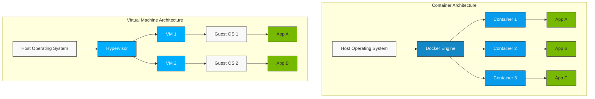
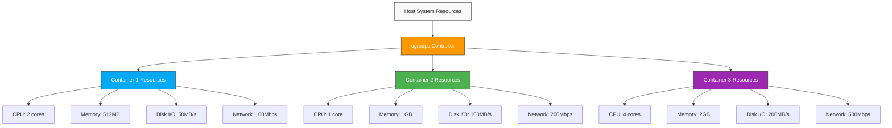
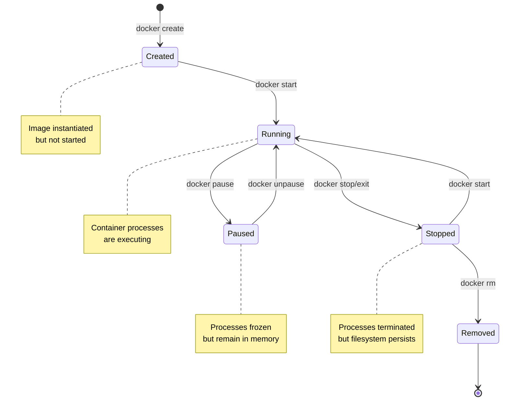

# Inception - Docker Infrastructure Project

A comprehensive Docker-based web infrastructure implementing WordPress, NGINX, MariaDB, and additional services with a focus on security, modularity, and best practices.

## Project Architecture

```ascii
                                +-----------------------+
                                |        Docker         |
                                |     Infrastructure    |
                                +-----------------------+
                                            |
                              +-------------+-------------+
                              |             |             |
                       +------v------+ +----v-------+ +---v------+
                       |   NGINX     | | WordPress  | | MariaDB  |
                       | Container   | | Container  | |Container |
                       +------+------+ +---+--------+ +---+------+
                              |            |              |
                              |            |              |
                    +---------v------------v--------------v-------+
                    |              Docker Network                 |
                    +---------------------------------------------+
                                           |
                     +-----------+---------+----------+-----------+
                     |           |         |          |           |
               +-----v---+ +-----v---+ +---v-----+ +--v------+ +--v--------+
               |  Redis  | |   FTP   | | Adminer | | Static  | | Portainer |
               |  Cache  | |  Server | |         | | Website | |           |
               +---------+ +---------+ +---------+ +---------+ +-----------+


               Volumes +------+----------------+
                              |                |
                        +-----v-----+    +-----v----+
                        | WordPress |    | Database |
                        |   Files   |    |   Data   |
                        +-----------+    +----------+
```

## Security Measures

1. Environment Variables
   - Stored in .env file
   - No hardcoded credentials
   - Secure variable passing

2. Network Isolation
   - Custom Docker network
   - Internal service communication
   - Limited external access

3. TLS Implementation
   - TLSv1.2/1.3 only
   - Strong cipher suites
   - Proper certificate management

## Setup Instructions

1. Clone the repository:

   ```bash
   git clone https://github.com/ElmehdiBennix/Inception_42.git
   cd Inception_42
   ```

2. Create .env file:

   ```bash
   # Edit srcs/.env with your configurations
   cp srcs/.env.example srcs/.env
   ```

3. Build and start services:

   ```bash
   # Start the project
   make
   # down the project
   make down
   # remove the project from docker
   make fclean
   ```

## Understanding Docker and Container Architecture

### What is Docker?

Docker is a platform for developing, shipping, and running applications in isolated environments called containers. Unlike traditional virtual machines that emulate entire operating systems, Docker containers share the host system's kernel and isolate only the application layer. This makes them lightweight, fast to start, and efficient with system resources.

## Containers vs. Virtual Machines

To understand Docker, we first need to compare containers with traditional virtualization:



The key difference is that traditional VMs virtualize the entire hardware stack and run a complete OS for each VM, while containers share the host OS kernel and isolate only the application layer. This makes containers significantly more lightweight and efficient.

## Linux Technologies That Enable containerization

Docker leverages several Linux kernel features to achieve containerization:

### 1. Namespaces

Namespaces provide isolation for system resources, making processes in a container believe they have their own instance of global resources. Linux implements six types of namespaces that Docker uses:

1. **PID Namespace**: Isolates process IDs. Processes in different namespaces can have the same PID.
2. **Network Namespace**: Isolates network interfaces, routing tables, firewall rules, etc.
3. **Mount Namespace**: Isolates filesystem mount points.
4. **UTS Namespace**: Isolates hostname and domain name.
5. **IPC Namespace**: Isolates interprocess communication resources.
6. **User Namespace**: Isolates user and group IDs.

### 2. Control Groups (cgroups)

Control Groups allow Docker to limit and isolate resource usage (CPU, memory, disk I/O, network, etc.) for each container. This prevents a single container from monopolizing resources and enables Docker to provide predictable performance.



### 3. Union File System

Docker uses a layered file system called Union File System (UnionFS) to efficiently create, store, and distribute container images. Each instruction in a Dockerfile creates a new layer, and Docker caches these layers to speed up builds and reduce storage requirements.

# Understanding Docker Architecture

Docker is built on a **client-server architecture** that enables the development, deployment, and management of containerized applications. It consists of several key components, each playing a specific role in how containers are created, run, and managed.

## Docker Engine

The **Docker Engine** is the core component that runs Docker. It consists of:

- **Docker Daemon (`dockerd`)**
- **REST API** for interacting with the daemon
- **CLI tools** for managing containers

Docker Engine is available in two versions:

- **Community Edition (CE):** Free and open-source for individual developers.
- **Enterprise Edition (EE):** A paid version with advanced security and management features.

### 1. Docker Client

The **Docker Client** is the main way users interact with Docker. It provides a **command-line interface (CLI)** (`docker`) that sends commands to the Docker Daemon via REST APIs.

#### Key features

- Executes commands like `docker run`, `docker build`, `docker ps`, etc.
- Can communicate with remote Docker daemons.
- Supports multiple clients connecting to the same daemon.

### 2. Docker Daemon (`dockerd`)

The **Docker Daemon** is a background process that runs on the host machine. It listens for API requests and manages Docker objects, such as containers, images, networks, and volumes.

#### Key responsibilities

- Builds, stores and runs containers.
- Manages images, volumes, and networks.
- Handles interactions with the **container runtime**.

---

## Compose

---

## Buildkit

---

## containerd (High-Level Container Runtime)

`containerd` is an **industry-standard container runtime** that manages the complete container lifecycle, including:

- Pulling images from a registry.
- Starting and stopping containers.
- Handling storage and networking.

Docker uses `containerd` as an intermediate layer between the **Docker Daemon** and the
low-level runtime.

---

## shims

---

## runc (Low-Level OCI Runtime)

`runc` is the **lightweight, low-level container runtime** that actually runs containers according to the **Open Container Initiative (OCI) specification**.

### Key role

- Directly interfaces with the host operating system to start and stop containers.
- Uses **Linux Namespaces** to provide process isolation (e.g., PID, NET, IPC, UTS, MNT, and USER namespaces).
- Uses **cgroups (Control Groups)** to manage and limit resource allocation (CPU, memory, I/O, etc.).
- Isolated from Docker itself, making it portable across different container management systems.

---

## Docker Registry

A **Docker Registry** is a service for storing and distributing Docker images.

### Types of registries

- **Public Registry:** Docker Hub (default), where anyone can upload and download images.
- **Private Registry:** Self-hosted registries or cloud-based solutions like AWS Elastic Container Registry (ECR), Google Container Registry (GCR), or Azure Container Registry (ACR).

Docker pulls images from the registry when running containers, and developers can push custom images to a registry.

---

## Storage

By default, all files created inside a container are stored on a writable container layer that sits on top of the read-only, immutable image layers.

### Types of Storage in Docker

#### Ephemeral Storage (Temporary, lost when the container stops)

- **Container Layer (Union Filesystem)**
  - Every running container has a writable layer that stores changes, but it is **lost when the container is deleted**.
- **`tmpfs` Mounts**
  - Stores files in RAM (memory), **not on disk**.
  - Used for sensitive data or performance optimization.
- **Named Pipes (`FIFO`)**
  - Used for **inter-process communication (IPC)**, **not for storage**.
  - Data exists only while being read/written.

#### Persistent Storage (Data persists even after container restarts)

- **Volumes**
  - Managed by Docker (`docker volume create mydata`).
  - Stored in `/var/lib/docker/volumes/` on the host.
  - Recommended for most persistent storage use cases.
- **Bind Mounts**
  - Directly map a **host directory** to a container path (`-v /host/path:/container/path`).
  - Allows direct file access but depends on the host’s filesystem structure.

### Storage Management

The **dockerd** daemon handles high-level volume management, while **containerd** interacts with storage drivers to manage the container’s filesystem.

---

## Networking

Docker creates isolated network stacks for containers using network namespaces a container has no information about what kind of network it's attached to, or whether their peers are also Docker workloads or not. A container only sees a network interface with an IP address, a gateway, a routing table, DNS services, and other networking details. That is, unless the container uses the none network driver.

Different **network drivers** Docker offers:

- **Bridge (default "docker0"):** Containers communicate inside the same host (internally).
- **Host:** Containers share the host network directly.
- **Overlay:** Used for multi-host container communication in Swarm mode.
- **Macvlan:** Assigns MAC addresses to containers for direct network access.
- **IPvlan:** More flexible layer 3 networking mode.
- **none:** Completely isolate a container from the host and other containers.

### Networking Management

dockerd **(the Docker daemon)** is responsible for setting up and managing container networking using network drivers and Linux networking features.

---

## Understanding PID 1 in Docker Containers

When a process runs inside a Docker container, the first process (with PID 1) has special significance:

```plaintext
               +-------------------+
               |  Docker Container |
               |                   |
               |   +----------+    |
               |   | Process 1 |   |
               |   |  (PID 1)  |   |
               |   +-----+-----+   |
               |         |         |
               |   +-----v-----+   |
               |   | Process 2 |   |
               |   |  (PID 2)  |   |
               |   +-----+-----+   |
               |         |         |
               |   +-----v-----+   |
               |   | Process 3 |   |
               |   |  (PID 3)  |   |
               |   +-----------+   |
               |                   |
               +-------------------+
```

PID 1 has several important responsibilities:

1. **Signal Handling**: PID 1 is responsible for handling signals and properly forwarding them to child processes.

2. **Zombie Process Reaping**: When child processes exit, they become "zombies" until their parent reaps them. If PID 1 doesn't handle this, zombie processes accumulate.

3. **Container Lifecycle**: The container's lifecycle is tied to PID 1. If PID 1 exits, the entire container stops.

Problems can arise when using a process not designed to be PID 1, such as a shell script or application without proper signal handling. This is why many Docker images use specialized init systems like `tini` or `dumb-init` to handle these responsibilities correctly.

## Understanding Container Lifecycle



## Understanding how Docker Works: Step-by-Step

Now let's me walk you through the complete process of how Docker works:

1. **Writing a dockerfile**

2. **Building an Image**:
   - When you run `docker build`, the Docker client sends your build context to the Docker daemon.
   - The daemon executes each instruction in the Dockerfile using Buildkit, creating a new layer for each instruction.
   - every Layer built is cached and stored as (read-only) layer for efficiency, so unchanged layers don't need to be rebuilt over and over.
   - The result is a stack of layers that form a Docker image.

3. **Running a Container**:
   - When you run `docker run`, the Docker client tells the daemon to create a new container from a specific image.
   - The daemon asks containerd to create the container.
   - containerd uses runc to create the container with the appropriate namespace and cgroup configurations.
   - A thin writable (R/W) layer is added on top of the image's read-only layers using UnionFS.
   - The PID 1 process specified in the image (via ENTRYPOINT or CMD) is started.
   - Various namespaces (PID, mount, network, etc.) are set up to isolate the container.
   - Resource limits are applied via cgroups.

4. **Container Communication**:
   - Containers can communicate with each other through Docker networks.
   - Port mapping allows external access to container services.
   - Volumes or bind mounts provide persistent storage.

5. **Container Termination**:
   - When a container is stopped, the PID 1 process receives a SIGTERM signal.
   - If the process doesn't exit within a grace period, it receives a SIGKILL.
   - The container's runtime resources are released, but the writable layer is preserved until the container is removed.

---

## Best Practices for Docker Containers

<!-- ### Process Design

1. **Use proper init systems** for PID 1 to handle signals and reap zombie processes.
2. **One process per container** as a general rule (with exceptions for tightly coupled processes).
3. **Non-root users** whenever possible to reduce security risks.

### Resource Management

1. **Set resource limits** using Docker's `--memory`, `--cpus` flags to prevent resource contention.
2. **Use health checks** to monitor container health and enable automatic recovery.
3. **Implement graceful shutdowns** to allow proper cleanup when containers stop.

## Best Practices

1. **In Docker**
   - Use multi-stage builds where appropriate
   - Minimize layer count
   - Implement proper caching
   - Clean up unnecessary files

2. **In Container Design**
   - Single responsibility principle
   - No unnecessary processes
   - Proper PID 1 handling
   - Clean shutdown handling

3. **In Security**
   - Minimal base images
   - Regular security updates
   - Proper permission management
   - Network isolation

4. **In Resource Management**
   - Volume mapping
   - Container restart policies
   - Resource limits
   - Health checks

5. **In Code Organization**
   - Modular Dockerfile structure
   - Clear documentation
   - Consistent naming conventions
   - Version control best practices -->

---

## In summary

Docker's containerization technology revolutionized application deployment by leveraging Linux kernel features like namespaces and cgroups. These technologies allow Docker to create isolated, portable, and efficient containers that share the host kernel while maintaining security and resource boundaries.

The layered approach to image building, combined with a client-server architecture and standardized container runtime, makes Docker a powerful platform for developing, shipping, and running applications in any environment that supports the Docker Engine.

Understanding the underlying technologies and concepts, especially namespaces, cgroups, UnionFS, and the importance of proper PID 1 handling, is crucial for effectively designing and managing containerized applications.
